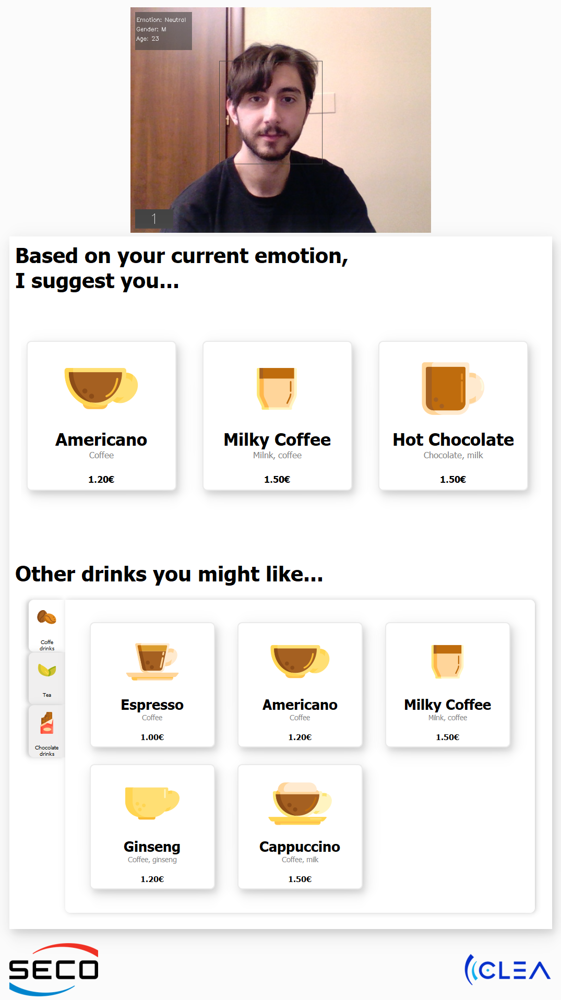
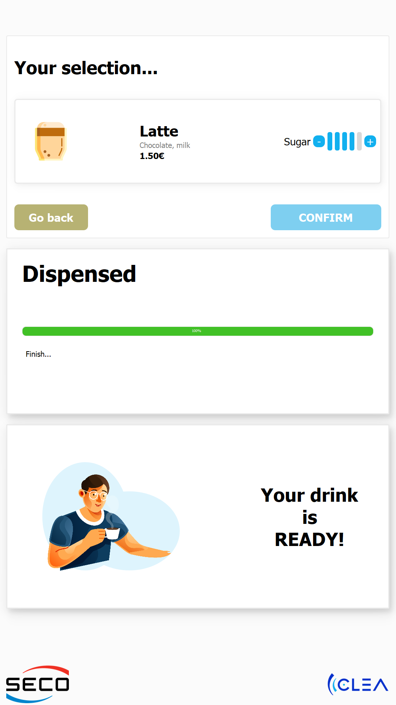
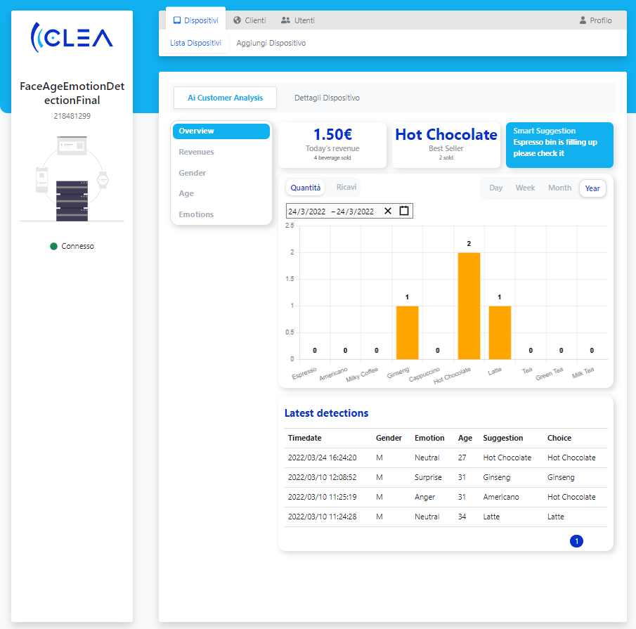
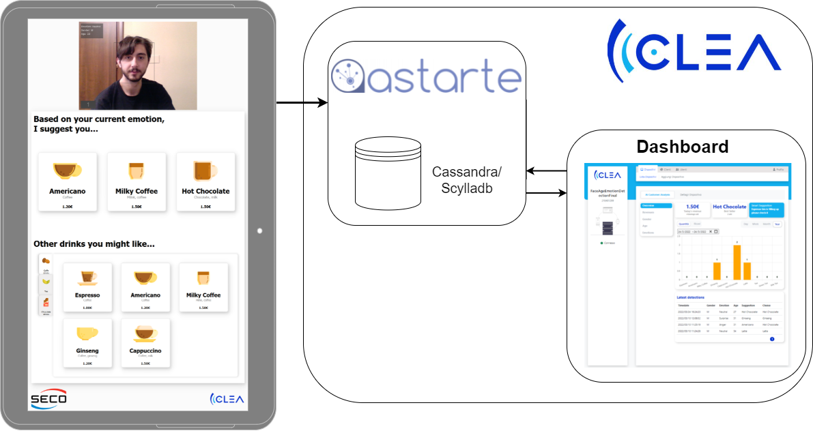
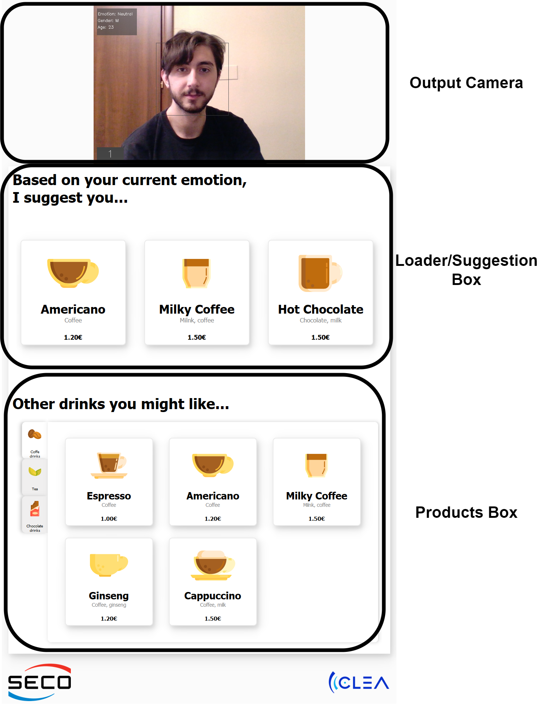
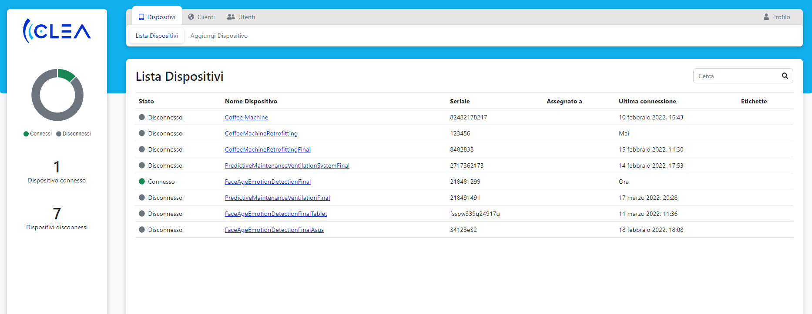
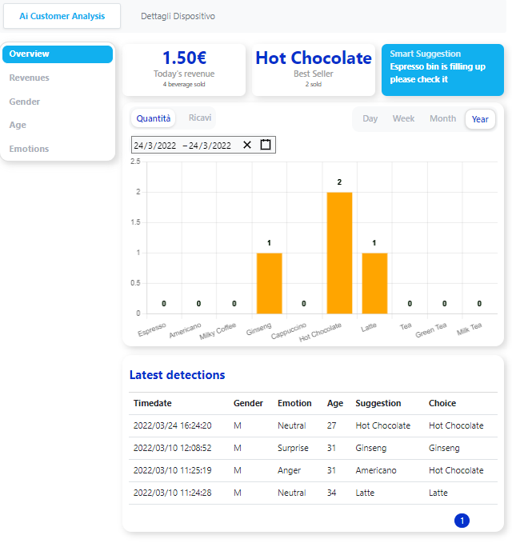

# Vending Machine
<!-- TOC -->

- [Vending Machine](#vending-machine)
    - [Introduction](#introduction)
    - [Vending machine software](#vending-machine-software)
        - [Code overview](#code-overview)
            - [Suggestion Algorithm](#suggestion-algorithm)
            - [Sending data to Astarte](#sending-data-to-astarte)
    - [Clea Dashboard App](#clea-dashboard-app)

<!-- /TOC -->
## Introduction

The project codebase is split between two main components: the vending machine software that handles the interface, data collection and beverage dispensing and the cloud application hosted on the Clea platform that shows aggregate data and statistics collected by the vending machine about the customers and their behaviours.

The application has a simple interface that shows the real-time feed from the camera and the suggested products. The machine uses a CNN (Convolutional Neural Network) to detect the face and estimate the gender, age, and emotions of the user. Once a beverage is selected, the machine starts dispensing it and uploads the data to the Astarte Cloud Platform (part of the Clea ecosystem).




Finally, Clea allows for an easy retrieval of this information, showing tables, charts and other statistics or aggregated data through and .



The image below summarises the lifecycle of the application.


## Vending machine software
The language used to develop the vending machine application is Python 3, using PyQT as the user interface framework.

The face detection and the gender, age, emotion estimations are estimated with a few Machine Learning models in ONNX format, accelerated through an OpenVino runtime environment to exploit the Intel hardware available onboard the SECO device.

### Code overview



In the following paragraphs we show and explain the main components of the software from a high level, providing details where needed.
###1. Image Elaboration

This tablet is using an external USB camera to capture images through the OpenCV library for Python.

The main UI is rendered in the main thread, while the image capture and elaboration is handled in a background thread (using QThreads).

Here is a snippet from the image elaboration thread:
```python
# imports include PyQT, OpenCV, numpy

# self.exec_net_face_det is the face detection model (CNN)

# this is in the run method of this thread
camera = cv2.VideoCapture(self.source)
while True:
    # Retrive a single frame
    _, frame = camera.read()
    resized_frame = cv2.resize(frame, (W, H))
    input_frame = np.expand_dims(resized_frame.transpose(2, 0, 1), 0)
    face_detected = self.exec_net_face_det.infer(inputs={input_layer_ir_face_det: input_frame})
    (real_y, real_x), (resized_y, resized_x) = frame.shape[:2], resized_frame.shape[:2]
    ratio_x, ratio_y = real_x / resized_x, real_y / resized_y
    detected_faces = []
    if face_detected:
        # analyze the faces
        for i in range(face_detected["detection_out"].shape[2]):
            conf = face_detected["detection_out"][0, 0, i, 2]
        if conf > 0.9:
            # Finding and scale corners from net output coordinates to frame coordinates
            (x_min, y_min, x_max, y_max) = [
                int(corner_position * ratio_y * resized_y)
                for idx, corner_position in enumerate(
                face_detected["detection_out"][0, 0, i, 3:]
                )
            ]
    detected_faces.append((x_min, y_min, x_max, y_max))
    else:
        self.updated.emit()
```
The ML model returns all the faces detected and based on the confidence of the model we wither accept or discard a proposed face. After some adjustments to the coordinates (in order to convert the model predicted bounding box to a compatible format for our images), we estimate the gender, age ad emotions on the main recognised face.

Here is a snippet:
```python
# self.exec_net_age_gen is the age and gender model (CNN)
# self.exec_net_emotions is the emotion estimation model (CNN)

emotion_labels = ['Neutral', 'Happy', 'Sad', 'Surprise', 'Anger']
for detected_face in detected_faces:
x = detected_face[0]
y = detected_face[1]
w = abs(detected_face[0] - detected_face[2])
h = abs(detected_face[1] - detected_face[3])

    try:
        customer_face = frame[y:y+h, x:x+w, :]

        resized_custome_face_ag = cv2.resize(customer_face, (W_ag, H_ag))
        resized_custome_face_em = cv2.resize(customer_face, (W_em, H_em))
        input_customer_face_ag = np.expand_dims(resized_customer_face_ag.transpose(2, 0, 1), 0)
        input_customer_face_em = np.expand_dims(resized_customer_face_em.transpose(2, 0, 1), 0)
        age_gender_prediction = self.exec_net_age_gen.infer(inputs={input_layer_ir_age_gen: input_custome_face_ag})
        emotions_prediction = self.exec_net_emotions.infer(inputs={input_layer_ir_age_gen: input_custome_face_em})

        emotion_label = emotion_labels[np.argmax(emotions_prediction)]

        apparent_age = int(age_gender_prediction["age_conv3"][0,0,0,0]*100)
        self.current_user['emotion'] = emotion_label
        self.current_user['age'] = apparent_age
        self.current_user['gender'] = gender

self.updated.emit()
```
The faces are preprocessed and adapted to the neural networks required input format.
After the prediction, we save the user information in order to send it to Astarte at a later time.

#### 2. Suggestion Algorithm

Starting from the user info estimated in the previous step, following a decision-tree like algorithm we select the appropriate beverages and display the to the screen in the Loader/Suggestion Box widget in the interface.

This portion of the interface displays a loader when there is no user in front of the machine.

####3. Beverage Dispensing

When the user selects a beverage either from the suggested products or from the global products list, the machine starts the dispensing and shows a real-time feedback on the screen in a different interface.

#### 4. Sending data to Astarte

The collected data is sent to the Astarte cloud as soon as the beverage has been dispensed.

The Astarte Cloud Platform provides a convenient Python library to connect and exchange data. This can be installed through pip as a PyPI package: $ pip install astarte-device-sdk .

In a few words the necessary steps to establish a connection with Astarte are: create a Device object ( from astarte import Device ) using the Astarte credentials and secrets, load the interfaces and use the various send methods.

Here is a code snippet of the connection initialisation:
```python
def load_interfaces(interfaces_dir):
    # An interface is a bundle of rules that the user must respect to send data.
    interfaces = []
    for interface_file in glob.iglob(interfaces_dir, recursive=True):
        with open(interface_file) as json_file:
            interfaces.append(json.load(json_file))
    return interfaces
    
    def callback(device, iname, ipath, payload):
        """ Method called when Astarte sends data to the device """
        print(device, iname, ipath, payload)
        return True

def connect_callback(sel):
    """ Method called when Astarte connects successfully to the device. """
    print("Device has connected!")

###########################
# Setup Device connection #
###########################

def set_device():
    os.makedirs(persistency_dir, exist_ok=True)
    device = Device(
        device_id=device_id,
        realm=realm, # A realm is a logical partition which holds a number of devices
        credentials_secret=credentials_secret,
        pairing_base_url=pairing_base_url,
        persistency_dir=persistency_dir
    )

    interfaces = load_interfaces(interfaces_dir_path)
    for interface in interfaces:
        device.add_interface(interface)

    device.on_connected = connect_callback
    device.on_data_received = callback

    device.connect()
    print("Wating for connection...")
    retry = 0
    while not device.is_connected() and retry<4:
        time.sleep(1)
        print(f"Device connection: {device.is_connected()}")
        retry += 1
    # Here we should be connected to Astarte
```
To send data we can use:
```python
def send_data(device, data):
    device.send_aggregate("ai.clea.examples.face.emotion.detection.Transaction", "/transaction", payload=data, timestamp=time.time())
```
where ai.clea.examples.face.emotion.detection.Transaction  is the name of the interface, /transaction  is the path in the interface, the payload is the data to be sent that must follow the rules described in the interface, and the timestamp is clear from the context.

So at the beginning of the code we initialise the connection and hold a reference to the device in a singleton pattern:
```python
class Singleton(type):
    _instances = {}
    def __call__(cls, *args, **kwargs):
        if cls not in cls._instances:
            cls._instances[cls] = super(Singleton, cls).__call__(*args, **kwargs)
        return cls._instances[cls]

class Astarte(metaclass=Singleton):
    pass

astarte = Astarte()
astarte.device = set_device()
```

## Clea Dashboard App

Clea is a platform that handles every aspect of the lifecycle and management of IoT devices.
Each tenant can handle a multitude of devices that can be dislocated in multiple places, that can have a different hardware and a different purpose and functionality. Among other things Clea provides an Astarte Cloud instance that can collect and manage data produces by those devices.

One of the easiest ways to retrieve data from Astarte is to use Clea and its ability to embed web applications that use the REST APIs provided by Astarte to show and display this information.



Each device can have its own dashboard and dataset that can be personalised and specific. In this application the devices share the same application, while they each use their own data.

To develop the dashboard web application we use **React** and **Typescript**. The application bundle is created as follows:
```typescript
export type AppProps = {
    astarteUrl: URL;
    realm: string;
    token: string;
    deviceId: string;
};

export type Settings = {
    themeUrl: string;
    userPreferences: UserPreferences;
};

const AppLifecycle = {
    mount: (container: ShadowRoot, appProps: AppProps, settings: Settings) => {
        ReactDOM.render(
            <>
                <link href={themeUrl} type="text/css" rel="stylesheet" />
                <link rel="stylesheet" href="https://cdnjs.cloudflare.com/ajax/libs/font-awesome/4.7.0/css/font-awesome.min.css"/>
                <style>{customCss}</style>
                <style>{dateRangePickerCss}</style>
                <IntlProvider defaultLocale="en">
                    <App {...appProps} />
                </IntlProvider>
            </>,
            container
        );
    },
unmount: (container: ShadowRoot) => ReactDOM.unmountComponentAtNode(container),
};

export default AppLifecycle;
```

To build `AppLifecycle` and inject the code into Clea, it's necessary to collect the properties/secrets of Astarte and of the device (see `AppProps`) and the `Settings`. Both are objects supplied by the platform.
Note: the `token` is a short-lived key. After it has been generated, it lasts 24h hours and a new one will be provided.

In the following snippet we show how to get data from Astarte:
```typescript
const App = ({ astarteUrl, realm, token, deviceId }: AppProps) => {
    const astarteClient = useMemo(() => {
        return new AstarteClient({ astarteUrl, realm, token });
    }, [astarteUrl, realm, token]);
            
    const [transactions, setTransactions] = useState<TransactionData[]>([]);
    
    useEffect(() => {
        getTransactions();
        const t = setInterval(getTransactions, 10000);
        return () => clearInterval(t); // clear
    }, [] );
    
    const getTransactions = async () => {
        const data = await astarteClient.getTransactionData({deviceId});
        setTransactions(data);
    };
    
    return (
        <>
        // your personal dashboard
        </>
    )
};

export default App;
```
The parameter `data` has all the transactions from our device.
```typescript
AstarteClient class is defined as:
class AstarteClient {
    config: Config;
    
    constructor({ astarteUrl, realm, token }: AstarteClientProps) {
        this.config = {
            astarteUrl,
            realm,
            token,
            appEngineUrl: new URL("appengine/", astarteUrl),
        };
    }

    async getTransactionData({ deviceId, sinceAfter, since, to, limit, downsamplingTo }: GetTransactionValuesParams) : Promise<TransactionData[]> {
        const { appEngineUrl, realm, token } = this.config;
        const interfaceName = "ai.clea.examples.face.emotion.detection.Transaction";
        const path = `v1/${realm}/devices/${deviceId}/interfaces/${interfaceName}/transaction`;
        const requestUrl = new URL(path, appEngineUrl);
        const query: Record<string, string> = {};
        if (sinceAfter) {
            query.sinceAfter = sinceAfter.toISOString();
        }
        if (since) {
            query.since = since.toISOString();
        }
        if (to) {
            query.to = to.toISOString();
        }
        if (limit) {
            query.limit = limit.toString();
        }
        if (downsamplingTo) {
            if (downsamplingTo > 2) {
                query.downsample_to = downsamplingTo.toString();
            } else {
                console.warn("[AstarteClient] downsamplingTo must be > 2");
            }
        }
        requestUrl.search = new URLSearchParams(query).toString();
        return axios({
            method: "get",
            url: requestUrl.toString(),
            headers: {
                Authorization: `Bearer ${token}`,
                "Content-Type": "application/json;charset=UTF-8",
            },
        }).then((response) => {
        // console.log("Got response from Astarte:", response);
        if (response.data.data) {
            response.data.data.forEach( (datapoint: any) => {
                datapoint.timestamp = moment.utc(datapoint.timestamp).unix();
            });
            return response.data.data
        }
        return [];
    });
}
```

Once the data has been collected, the user interface is populated and the following dashboard is shown.


